<h3 align="center">It's me. Hi. I'm the problem. It's me.</h3>

  

<h1 align="center">Hey, I'm Harshvardhan Singh 👋</h1>

  Software Engineer · UI/UX designer · Swiftie 
  Lucknow, India · he/him

  
  
  
  

---

### About

- 🛠 &nbsp;Currently SDE at [AirLyft.One](https://www.linkedin.com/company/airlyftone), building full-stack TypeScript systems
- 👯 &nbsp;Open to collaborating on **open-source projects**
- 🤝 &nbsp;Happy to chat about **system architecture, TS albums, and agentic coding**
- 🌐 &nbsp;Portfolio: **[hrshvrdhn.com](https://hrshvrdhn.com)**
- 🎧 &nbsp;Fun fact: my favorite Taylor Swift album is *folklore*

---

### Stack

**Languages**

  

**Frameworks & Libraries**

  

**Databases & Infra**

  

**Tools**

  

**Design**

  

---

### Stats

<!-- These cards are self-hosted via .github/workflows/update-stats.yml -->

  
  &nbsp;
  

  

---

### Recent Activity

<!--START_SECTION:activity-->
<!-- Auto-updated by .github/workflows/update-activity.yml -->
<!--END_SECTION:activity-->

---

### What I'm listening to

  

  

---

Long story short, I survived.
